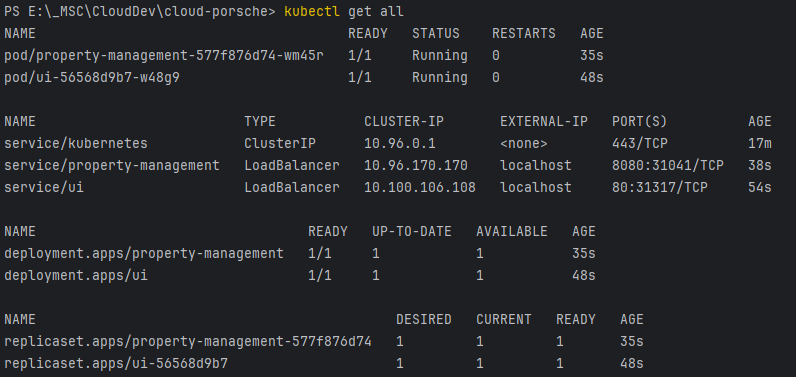

# Cloud Porsche Managment Solution

This is the combined monorepo of all the services that are part of the Cloud Porsche Management Solution for
`Cloud Application Development @ HTWG`.

## Docker Compose

To run the entire solution locally, you can use the provided `docker-compose.yml` file. This file contains all the
services that are part of the Cloud Porsche Management Solution.

### Prerequisites

- All services that need the `@cloud-porsche/types` package have to be linked to it. To do this, run
  `npm run link-types` in the service that needs the package.
- The `@cloud-porsche/types` package has to be built before running the services. To do this, run `pnpm run build` in
  the
  `cloud-dev-types` directory.
- The context of the Dockerfiles (for each directory) needs to be set to the root  
  (e.g. `.` instead of `./cloud-dev-ui`). Check the provided IntelliJ run configurations for an example.

## Kubernetes (Deprecated: use helm)

Ensure you have up-to-date images by running

```
docker compose build --no-cache
```

before deploying to Kubernetes.

To deploy the solution to Kubernetes, you can use the provided `k8s` directory. This directory contains all the
necessary files to deploy the solution to a Kubernetes cluster.

Once all services + deployments are running, you can check what services are running by running

```
kubectl get all
```

and it should look something like this:


## Helm

### Prerequisites

- Helm is installed - check with `helm version`
- You have your secrets on you either by using the `--set` flag or by using a `values-secrets.yaml` file

### Usage

#### Package

To package the Helm chart, run

```
helm package ./helm/cloud-porsche-default 
```

#### Install

To install the Helm chart, run

```
helm install cloud-porsche ./helm/cloud-porsche-default-0.1.0.tgz --values ./helm/cloud-porsche-default/values.yaml,./helm/cloud-porsche-default/values-secrets.yaml
```
